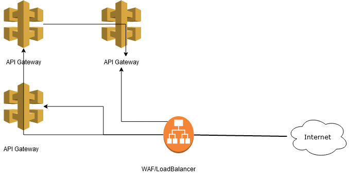

# HTTPRequestSmuggling
ELI5/ Deep Dive - HTTTP Request Smuggling


## TL;DR - What is it?
Read: https://portswigger.net/web-security/request-smuggling

## Lets dive!

#### So why exactly is this dangerous from a security perspective

Most modern web application infrastructure consists of one or many load balancers/WAFs, which sit in front of actual application servers. Typically, the trust model for these is that traffic to the load balancer from the outside internet is seen as unsafe, but traffic from the load balancer to the application server or from the application server itself is safer as it has made it past the load balancer security controls.

Consider this: In the below diagram, we see some sort of WAF/Load Balancer that sits in front of several API gateways. If the infrstructure is such that the assumption is that illegitemate/unsafe traffic is prevented from hitting the API's via the WAF, then smuggling requests past the WAF enable us to send requests to API endpoints that we were not allowed to send requests from outside the security perimeter.



## Example
The following POST request is an example of smuggling a POST request to an internal API named `secure-API` In this case, we are dealing with the load balancer accepting the `Transfer-Encoding` header, and the API accepting the `Content-Length` this is called a `TE.CL` attack.

```
POST / HTTP/1.1
Host: test.mysite.net
User-Agent: Mozilla/5.0 (Windows NT 10.0; Win64; x64; rv:72.0) Gecko/20100101 Firefox/72.0
Accept: text/html,application/xhtml+xml,application/xml;q=0.9,image/webp,*/*;q=0.8
Accept-Language: en-US,en;q=0.5
Accept-Encoding: gzip, deflate
Referer: https://somesite.net
DNT: 1
Connection: close
Cookie: session=F9Rf9fqjQ37lLSBDd3EHEpehDygMs75i
Upgrade-Insecure-Requests: 1
Content-Type: application/x-www-form-urlencoded
Content-Length: 3
Transfer-Encoding: chunked

68
POST /secure-API HTTP/1.1
Content-Type: application/x-www-form-urlencoded
Content-Length: 20

foo=ba
0


```
Sending this request twice will have the intended affect of POST'ing `foo=bar` to the `secure-API` resource.

### Why does this work?
1. The first evaluation is by the load balancer that supports the `Transfer-Encoding` header, it observes that the length of the body of the request should be 104 chars long, <b> the `Transfer-Encoding` length is specified in Hex hence `68` </b> which is the decimal equivalent of 104. Thus the first chunk ends at the beginning of the line that contains 0 <b>(remember each newline also counts as a byte!)</b>b. The second chunk is processed as 0 which is read as the end of the request
2. The request is forwarded to a server that then supports `Content-Length` which sees that the request body should only be 3 bytes long, so it reads up to the end of `68`, as it is reading `68\n` <- 3 bytes
3. The remaining 

```
68
POST /secure-API HTTP/1.1
Content-Type: application/x-www-form-urlencoded
Content-Length: 20

foo=ba
0
```
Is left on the server and will prepend any incoming request!


MISC 
* TE.CL turn off content length and add 2 returns 
